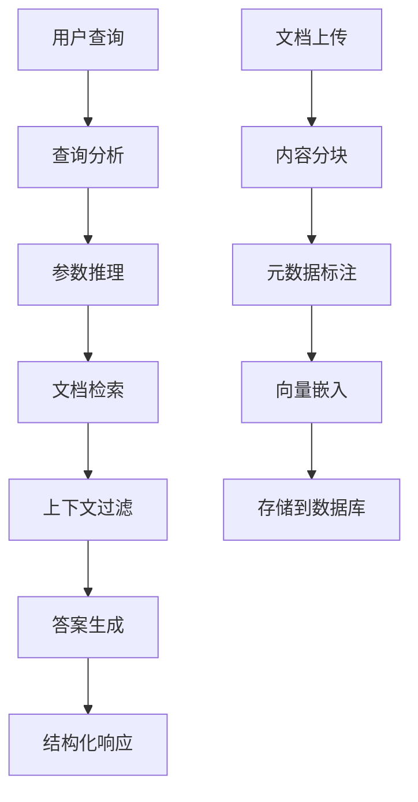

# NestJS查询分析RAG模块架构设计

## 1. 产品概述

本项目旨在将Python版本的查询分析RAG教程改写为NestJS版本，并集成到AI-Chat-Be项目中。该模块实现智能查询分析、精确文档检索和高质量答案生成的完整RAG工作流。

- 核心功能：基于LangGraph的查询分析RAG系统，支持智能查询参数推理、分段文档检索和结构化答案生成
- 目标价值：为AI-Chat-Be项目提供高级RAG能力，提升问答系统的准确性和用户体验

## 2. 核心功能

### 2.1 用户角色

| 角色 | 注册方式 | 核心权限 |
|------|----------|----------|
| 普通用户 | 现有用户系统 | 可进行基础RAG查询，查看检索结果 |
| 管理员用户 | 系统管理员分配 | 可管理知识库文档，配置RAG参数，查看系统统计 |

### 2.2 功能模块

我们的查询分析RAG模块包含以下核心页面：
1. **RAG查询接口**：智能查询分析、文档检索、答案生成
2. **知识库管理**：文档上传、分段管理、元数据配置
3. **系统配置**：模型参数设置、检索策略配置

### 2.3 页面详情

| 页面名称 | 模块名称 | 功能描述 |
|----------|----------|----------|
| RAG查询接口 | 查询分析器 | 使用LLM分析用户查询，推理出查询参数（关键词、文档分段） |
| RAG查询接口 | 文档检索器 | 基于查询参数进行向量相似性搜索，支持元数据过滤 |
| RAG查询接口 | 答案生成器 | 基于检索到的上下文生成结构化答案 |
| 知识库管理 | 文档处理 | 支持网页内容加载、文档分块、元数据标注 |
| 知识库管理 | 向量存储 | 使用Chroma向量数据库存储文档嵌入 |
| 系统配置 | 模型配置 | 配置嵌入模型、LLM模型参数 |
| 系统配置 | 检索策略 | 设置相似性阈值、检索数量、过滤条件 |

## 3. 核心流程

**用户查询流程：**
用户提交自然语言查询 → 查询分析器推理查询参数 → 文档检索器执行向量搜索 → 答案生成器基于上下文生成回答 → 返回结构化响应

**管理员流程：**
管理员上传文档 → 系统自动分块处理 → 添加元数据标签 → 生成向量嵌入 → 存储到向量数据库

## 4. 用户界面设计

### 4.1 设计风格

- 主色调：#2563eb（蓝色）、#f8fafc（浅灰背景）
- 按钮样式：圆角按钮，支持悬停效果
- 字体：系统默认字体，标题16px，正文14px
- 布局风格：卡片式布局，响应式设计
- 图标风格：简洁线性图标，支持主题色彩

### 4.2 页面设计概览

| 页面名称 | 模块名称 | UI元素 |
|----------|----------|--------|
| RAG查询接口 | 查询输入区 | 文本输入框、查询按钮、参数显示卡片 |
| RAG查询接口 | 结果展示区 | 答案卡片、来源文档列表、相似度评分 |
| 知识库管理 | 文档列表 | 表格布局、分页组件、操作按钮组 |
| 知识库管理 | 上传界面 | 拖拽上传区、进度条、预览组件 |
| 系统配置 | 参数设置 | 表单组件、滑块控件、开关按钮 |

### 4.3 响应式设计

采用移动优先的响应式设计，支持桌面端和移动端访问，优化触摸交互体验。