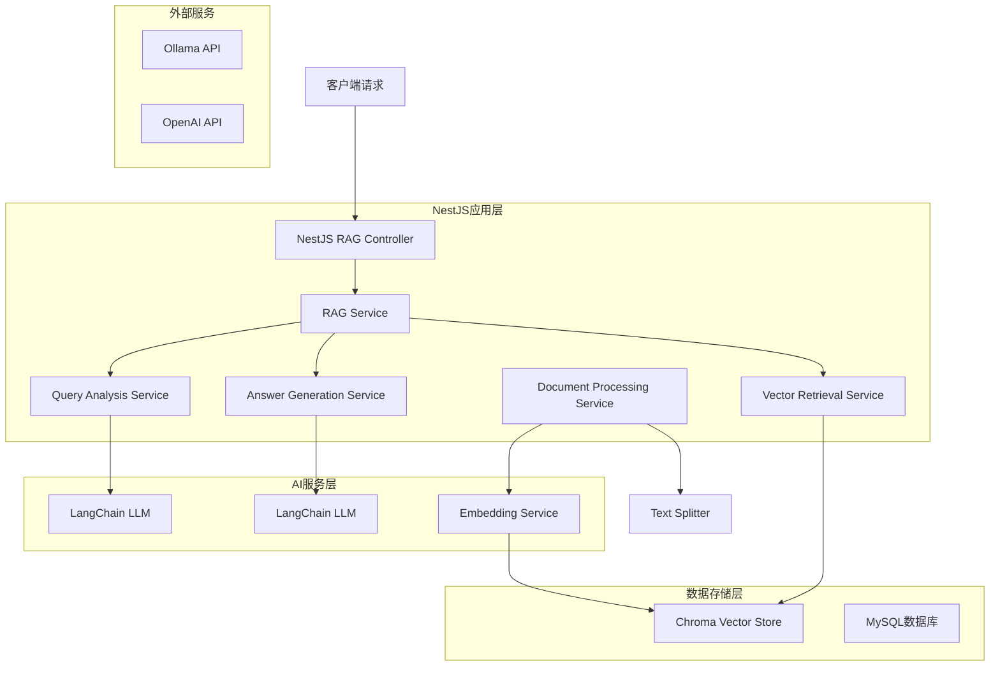
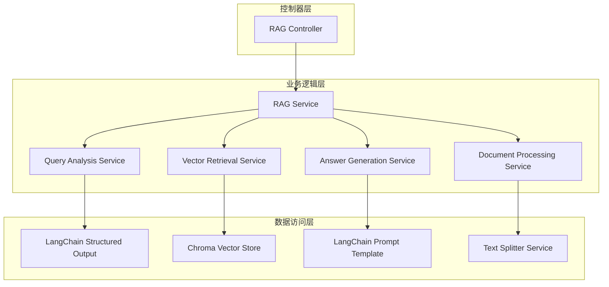
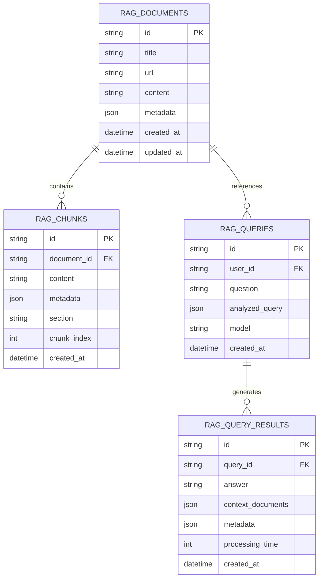

# NestJS查询分析RAG模块技术架构

## 1. 架构设计



## 2. 技术描述

* Frontend: 无（纯后端API服务）

* Backend: NestJS\@11 + TypeScript + LangChain\@0.3 + @langchain/langgraph\@0.4

* Vector Database: Chroma (通过langchain-chroma集成)

* Embedding: Ollama Embeddings (shaw/dmeta-embedding-zh)

* LLM: 支持多模型 (Qwen2.5, Llama3.1, DeepSeek等)

* Database: MySQL\@3.11 (现有数据库)

* Cache: Redis\@4.7 (现有缓存)

## 3. 路由定义

| 路由                        | 用途                   |
| ------------------------- | -------------------- |
| POST /rag/query           | 执行查询分析RAG查询，返回智能分析结果 |
| POST /rag/documents       | 添加新文档到知识库            |
| GET /rag/documents        | 获取知识库文档列表            |
| DELETE /rag/documents/:id | 删除指定文档               |
| POST /rag/documents/batch | 批量处理文档（网页、PDF等）      |
| GET /rag/config           | 获取RAG系统配置            |
| PUT /rag/config           | 更新RAG系统配置            |
| GET /rag/health           | 检查RAG服务健康状态          |

## 4. API定义

### 4.1 核心API

**查询分析RAG接口**

```
POST /rag/query
```

Request:

| 参数名称     | 参数类型   | 是否必需  | 描述         |
| -------- | ------ | ----- | ---------- |
| question | string | true  | 用户的自然语言查询  |
| model    | string | false | 指定使用的LLM模型 |
| options  | object | false | 查询选项配置     |

Response:

| 参数名称          | 参数类型    | 描述        |
| ------------- | ------- | --------- |
| success       | boolean | 请求是否成功    |
| data          | object  | 查询结果数据    |
| data.answer   | string  | 生成的答案     |
| data.query    | object  | 分析后的查询参数  |
| data.context  | array   | 检索到的文档上下文 |
| data.metadata | object  | 查询元数据信息   |

Example Request:

```json
{
  "question": "文章的结尾讲了langgraph的哪些优点？",
  "model": "qwen2.5",
  "options": {
    "temperature": 0,
    "maxTokens": 1000
  }
}
```

Example Response:

```json
{
  "success": true,
  "data": {
    "answer": "根据文章结尾部分，LangGraph的主要优点包括：1. 灵活的工作流设计...",
    "query": {
      "query": "langgraph 优点",
      "section": "结尾"
    },
    "context": [
      {
        "content": "文档内容...",
        "metadata": {
          "section": "结尾",
          "score": 0.95
        }
      }
    ],
    "metadata": {
      "processingTime": 1250,
      "model": "qwen2.5",
      "timestamp": "2025-01-20T10:30:00Z"
    }
  }
}
```

**文档管理接口**

```
POST /rag/documents
```

Request:

| 参数名称     | 参数类型   | 是否必需  | 描述                 |
| -------- | ------ | ----- | ------------------ |
| url      | string | false | 网页URL（与content二选一） |
| content  | string | false | 文档内容（与url二选一）      |
| title    | string | true  | 文档标题               |
| metadata | object | false | 文档元数据              |

Response:

| 参数名称        | 参数类型    | 描述      |
| ----------- | ------- | ------- |
| success     | boolean | 处理是否成功  |
| documentId  | string  | 生成的文档ID |
| chunksCount | number  | 分块数量    |

## 5. 服务架构图



## 6. 数据模型

### 6.1 数据模型定义



### 6.2 数据定义语言

**RAG文档表 (rag\_documents)**

```sql
-- 创建表
CREATE TABLE rag_documents (
    id VARCHAR(36) PRIMARY KEY DEFAULT (UUID()),
    title VARCHAR(255) NOT NULL,
    url TEXT,
    content LONGTEXT,
    metadata JSON,
    created_at TIMESTAMP DEFAULT CURRENT_TIMESTAMP,
    updated_at TIMESTAMP DEFAULT CURRENT_TIMESTAMP ON UPDATE CURRENT_TIMESTAMP
);

-- 创建索引
CREATE INDEX idx_rag_documents_title ON rag_documents(title);
CREATE INDEX idx_rag_documents_created_at ON rag_documents(created_at DESC);
```

**RAG文档块表 (rag\_chunks)**

```sql
-- 创建表
CREATE TABLE rag_chunks (
    id VARCHAR(36) PRIMARY KEY DEFAULT (UUID()),
    document_id VARCHAR(36) NOT NULL,
    content TEXT NOT NULL,
    metadata JSON,
    section VARCHAR(50),
    chunk_index INT NOT NULL,
    created_at TIMESTAMP DEFAULT CURRENT_TIMESTAMP,
    FOREIGN KEY (document_id) REFERENCES rag_documents(id) ON DELETE CASCADE
);

-- 创建索引
CREATE INDEX idx_rag_chunks_document_id ON rag_chunks(document_id);
CREATE INDEX idx_rag_chunks_section ON rag_chunks(section);
```

**RAG查询表 (rag\_queries)**

```sql
-- 创建表
CREATE TABLE rag_queries (
    id VARCHAR(36) PRIMARY KEY DEFAULT (UUID()),
    user_id VARCHAR(36),
    question TEXT NOT NULL,
    analyzed_query JSON,
    model VARCHAR(100),
    created_at TIMESTAMP DEFAULT CURRENT_TIMESTAMP,
    FOREIGN KEY (user_id) REFERENCES users(id) ON DELETE SET NULL
);

-- 创建索引
CREATE INDEX idx_rag_queries_user_id ON rag_queries(user_id);
CREATE INDEX idx_rag_queries_created_at ON rag_queries(created_at DESC);
```

**RAG查询结果表 (rag\_query\_results)**

```sql
-- 创建表
CREATE TABLE rag_query_results (
    id VARCHAR(36) PRIMARY KEY DEFAULT (UUID()),
    query_id VARCHAR(36) NOT NULL,
    answer LONGTEXT NOT NULL,
    context_documents JSON,
    metadata JSON,
    processing_time INT,
    created_at TIMESTAMP DEFAULT CURRENT_TIMESTAMP,
    FOREIGN KEY (query_id) REFERENCES rag_queries(id) ON DELETE CASCADE
);

-- 创建索引
CREATE INDEX idx_rag_query_results_query_id ON rag_query_results(query_id);
CREATE INDEX idx_rag_query_results_processing_time ON rag_query_results(processing_time);

-- 初始化数据
INSERT INTO rag_documents (title, url, metadata) VALUES 
('LangGraph实践教程', 'http://wfcoding.com/articles/practice/0318/', '{"category": "tutorial", "language": "zh"}');
```

